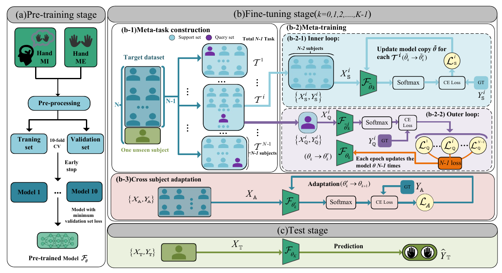

# MLEMSDA
This is a PyTorch implementation of the Meta-Learning Enhanced Multi-Source Domain Adaptation for Zero-Calibration Motor Imagery EEG Decoding.

This is an example with openBMI and HGD as source domains and CBCIC as target domain.

This study aims to explore the feasibility of cross-dataset, cross-task and cross-user knowledge transfer, which can greatly relax the limitations of stroke MI brain-computer interface training samples and has important practical significance.

# Resources
## Datasets
openBMI:[Link](http://gigadb.org/dataset/100542)

HGD:[Link](https://github.com/robintibor/high-gamma-dataset)

CBCIC:[Link](https://github.com/5anirban9/Clinical-Brain-Computer-Interfaces-Challenge-WCCI-2020-Glasgow)

## Sample pre-trained DeepConvNet models
For CBCICI:  MLEMSDA/pretrain_deep_cbcic/Tpretrain_model/model_cv5.pt

# Dependencies

It is recommended to create a virtual environment with python version 3.9 and running the following:

    pip install -r requirements.txt
## Obtain the raw dataset
Download the raw dataset from the [resources](https://github.com/HZUBCI/MSDDAEF/blob/main/README.md#datasets) above (Please download the MI data in mat file format), and save them to the same folder. 

        MLEMSDA/process_cbcic_hgd_bmi/data/hgd/test/1.mat
                                                    /...
                                               /train/1.mat
                                                     /...
    
        MLEMSDA/process_cbcic_hgd_bmi/data/openBMI/sess01_subj01_EEG_MI.mat
                                                   /sess01_subj02_EEG_MI.mat
                                                   /...
                                                   /sess02_subj01_EEG_MI.mat
                                                   /sess02_subj02_EEG_MI.mat
                                                   /...
        MLEMSDA/process_cbcic_hgd_bmi/data/cbcic/parsed_P01E.mat
                                                 /parsed_P01T.mat
                                                 /...

